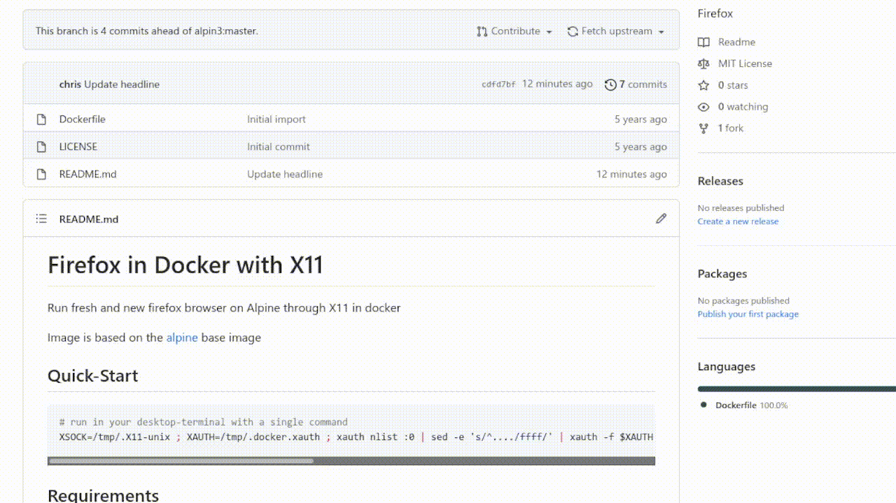

# Firefox in Docker with X11

Run fresh and new firefox browser on Alpine through X11 in docker

Image is based on the [alpine](https://hub.docker.com/_/alpine/) base image

## Quick-Start

```bash
# run in your desktop-terminal with a single command
XSOCK=/tmp/.X11-unix ; XAUTH=/tmp/.docker.xauth ; xauth nlist :0 | sed -e 's/^..../ffff/' | xauth -f $XAUTH nmerge - ; docker run -e "DISPLAY=:1" -v $XSOCK:$XSOCK -v $XAUTH:$XAUTH -e XAUTHORITY=$XAUTH  user2k20/firefox
```

## Demo



## Requirements

- Docker and X11 installed

## Run with simple alias: docker-firefox

```bash
# create alias in the .bash_rc or .bash_aliases file
cat <<EOF | tee -a ~/.bash_rc
alias docker-firefox='XSOCK=/tmp/.X11-unix ; XAUTH=/tmp/.docker.xauth ; xauth nlist :0 | sed -e 's/^..../ffff/' | xauth -f $XAUTH nmerge - ; docker run -e "DISPLAY=:1" -v $XSOCK:$XSOCK -v $XAUTH:$XAUTH -e XAUTHORITY=$XAUTH  user2k20/firefox'
EOF
source ~/.bash_rc
```

Now you only need to execute this in your terminal: `docker-firefox`

## Examples

Typical usage:

```bash
XSOCK=/tmp/.X11-unix
XAUTH=/tmp/.docker.xauth
xauth nlist :0 | sed -e 's/^..../ffff/' | xauth -f $XAUTH nmerge -
docker run --rm -e "DISPLAY=:1" -v $XSOCK:$XSOCK -v $XAUTH:$XAUTH -e XAUTHORITY=$XAUTH  user2k20/firefox
```
